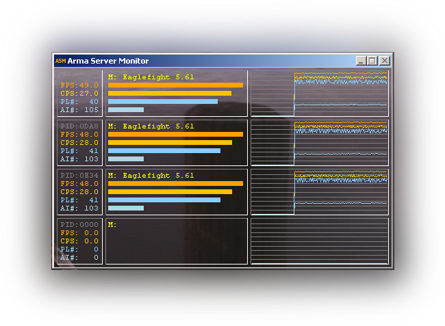

#Arma Server Monitor#

"Arma Server Monitor" is a spin-off of my playing around with the arma engine.

Propertys:

	- monitors up to 4 server (or headless client) instances simultaneous 
	- introduces a performance value CPS for FSM processing analysis
	- very simple, compact and solid design
	- almost no influence to cpu load
	- easy to use (mini addon)
	- customizable history graps 	

Currently able to monitor the following values:

	- FPS (on a server this means simulation frames per second)
	- CPS (Condition-evaluation Per Second)
	- PL# (Number of alive player units)
	- AI# (Number of alive local AI units)
	- PID (process ID of the server instance)
	- Name of the currently played mission (missionName)

**Arma Server Monitor** consists of 3 components:

	ASM.fsm 				- Collects and reports some internal performance states from arma server (or HC)
	ASMdll.dll 				- Interfaces to ArmaServerMonitor.exe via MMF (Memory Mapped File)
	ArmaServerMonitor.exe 	- The Monitor itself reads from MMF and displays the values

Alongside to the well known FPS (frames per second), an very interesting value **CPS** is introduced here.    
**CPS** is expressed by **condition** **evalations** per **second** and measured from an reference condition in `ASM.fsm`.   

You can realize this **CPS** value as the reciprocal of the current "minimal response delay" of AI in the running mission.    

Two examples to illustrate this value:   
Lets say we have an CPS value of 10.0, then our AI has an average response delay of ca. 100ms here (1000ms/10.0).   
That means everything runs well in our first scenario.         
In a second scenario we have a CPS value of 0.3, what means AI has a **minimal** response delay larger than 3 seconds !!!    
Especially COOP missions running with such low **CPS** are really no pleasure. AI seems to be "stupid".   

(If low CPS values occurs together with normal FPS values, I'd recommend to have a talk with the mission developer,    
because this behavior is very likely caused by excessively use of execVM, spawn etc.)    

**How to use ASM:**

Put `ASMdll.dll` in your arma directory (where arma3server.exe resists)
   
Extract this file: [https://github.com/fred41/ASM/blob/master/addon/ASM.zip](https://github.com/fred41/ASM/blob/master/addon/ASM.zip)    to your Arma 3 root folder.

Add -mod=@ASM to your server (or HC) launch params. 

Run `ArmaServerMonitor.exe` to monitor all your server (or HC) instances.

(use right mouse button for popup menus)

*ENJOY :)*     

Changelog:    
01.06.2013 Changed the install/launch method to mini-addon (thanks terox for inspiration)    
01.06.2013 Fixed: instance occupied additional slot at mission change    
02.06.2013 Changed bar graphs for CPS & FPS to logarithmic scale to show states more intuitive   
03.06.2013 Added history graphs, customizable (individual visibility, update interval), transparency switch    
    